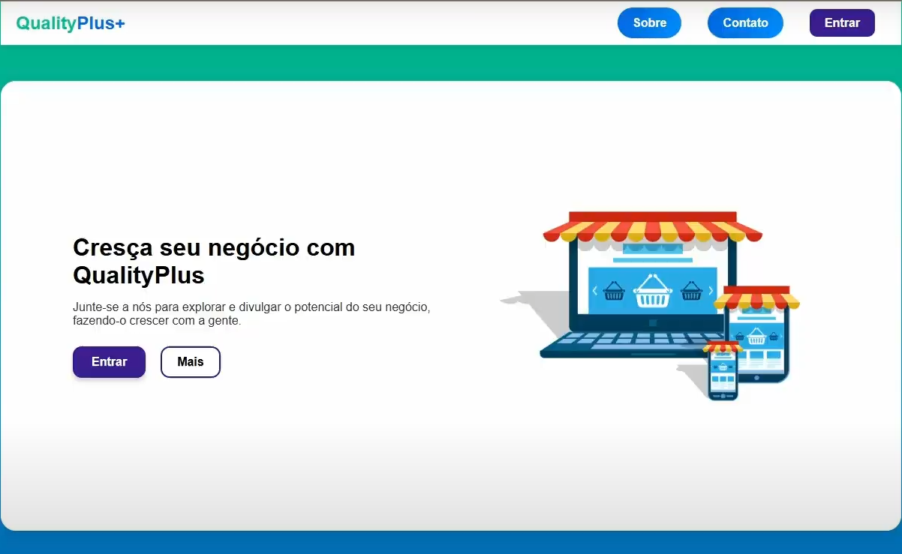

# QualityPlus+


**QualityPlus+** é uma plataforma inovadora que facilita a integração de empresas e lojas ao site, auxiliando os usuários a encontrá-las. Com um sistema semelhante à Amazon, mas sem a funcionalidade de compra, o objetivo do QualityPlus+ é mostrar os preços dos itens próximos ao usuário, informando em quais lojas estão disponíveis. Além disso, o sistema se integra ao **Google Maps** para exibir a localização das lojas e oferece uma ferramenta de **comparação de itens e preços**.

---

## 🚀 Tecnologias Utilizadas

- **Laravel** - Framework PHP robusto e eficiente
- **MySQL** - Banco de dados relacional
- ~~Google Maps API - Para exibir e localizar lojas próximas~~

---

## 📷 Captura de Tela



---

## 📌 Funcionalidades

✅ Localização de lojas próximas ao usuário 
✅ Comparação de preços entre diferentes lojas 
✅ Sistema de autenticação com criação de conta e perfis 
✅ Integração com Google Maps para visualização das lojas 

---

## 📥 Instalação

Para rodar o projeto localmente, siga os passos abaixo:

1. Clone o repositório:
   ```bash
   git clone https://github.com/VictorLemos1000/QualityPlus.git
   cd QualityPlus
   ```

2. Instale as dependências do Laravel:
   ```bash
   composer install
   ```

3. Configure o banco de dados no arquivo **.env**:
   ```
   DB_CONNECTION=mysql
   DB_HOST=127.0.0.1
   DB_PORT=3306
   DB_DATABASE=qualityplus
   DB_USERNAME=root
   DB_PASSWORD=
   ```

4. Rode as migrations para criar as tabelas no banco:
   ```bash
   php artisan migrate
   ```

5. Inicie o servidor local do Laravel:
   ```bash
   php artisan serve
   ```

Agora, o projeto estará disponível no navegador em `http://127.0.0.1:8000`

---

## 🔑 Autenticação

O sistema possui um **módulo de autenticação**, onde o usuário precisa **criar uma conta e fazer login** para acessar certas funcionalidades, como criar perfis e salvar suas lojas favoritas.

---

## 🏷️ Licença

Este projeto ainda não possui uma licença definida.

---

## 📬 Contato

Caso tenha alguma dúvida ou sugestão, entre em contato pelo GitHub!

---

Feito por [Eudes Pontes, Victor Lemos, Lucas Luiz]
